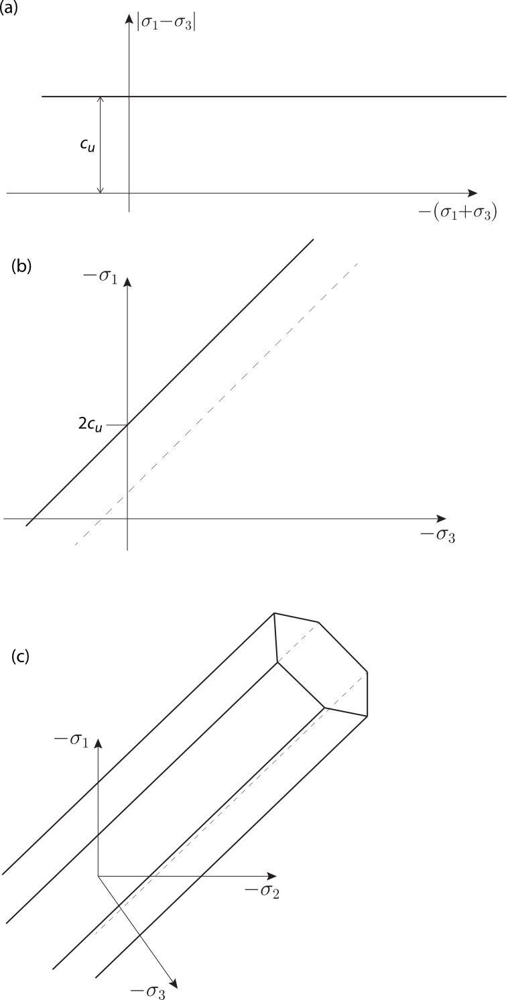
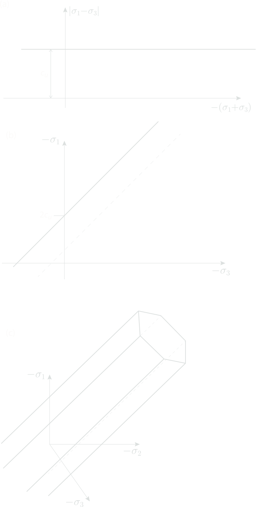

# 5 Tresca

The Tresca model is essentially a special case of the Mohr-Coulomb model
where the cohesion is set equal to the undrained shear strength,
$c'=c_u$, the friction angle is set equal to zero and Poisson's ratio is
set equal to $\frac{1}{2}$. The Tresca model implicitly assumed
undrained conditions with the stresses being the total stresses. As
such, the Tresca model should not be linked to other models, e.g.
Mohr-Coulomb, making use of effective stresses.

## 5.1 Summary of material parameters

### Stiffness

-   $E_u$: undrained Young's modulus (see Section
    [Elasticity](/optum-gx/materials/2-elasticity) for relation to drained modulus)

### Strength

-   $c_u$: undrained shear strength

## 5.2 Governing equations

### 5.2.1 Elasticity

Isotropic elasticity defined by $E_u$ is used (see Section
[Elasticity](/optum-gx/materials/2-elasticity)).

### 5.2.2 Failure surface

The Tresca failure surface is given by

$$
F = |\sigma_1-\sigma_3| - 2c_u \tag{5.1}
$$ 

where $c_u$ is the undrained shear strength.

Some possible depictions of the Tresca failure surface are shown in Figure 5.1.

### Flow rule

The flow potential is associated:

$$
\dot{\boldsymbol\varepsilon}^p = \dot\lambda\frac{\partial F}{\partial\boldsymbol\sigma} \tag{5.2}
$$

{#relight} 
{#redark}
:::custom-caption
Figure 5.1: Possible depictions of Tresca yield surface in principal stress space. In (a) and (b), the principal stress ordering is
$\sigma_1\leq\sigma_2\leq\sigma_3$ while no particular ordering is
assumed in (c).
:::