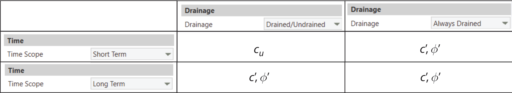

# 6 MC Engineering

The Mohr-Coulomb and Tresca models both have their advantages and limitations. Under drained conditions, the Mohr-Coulomb model produces results that generally accepted and that have a transparent relation to the input parameters $(E,\nu,c',\phi')$. Under undrained conditions, however, the undrained shear strength implied by the Mohr-Coulomb model is often at odds with what is measured in the field. Hence, for such analyses, Tresca – with direct input of the undrained shear strength (constant or varying with depth) – is often preferred.

For bearing capacity and factor of safety assessment, this effectively necessitates two separate models: a Mohr-Coulomb model with drained parameters ($c'$ and $\phi'$) and a Tresca model with the undrained ($c_u$).

Secondly, linking the effective stress Mohr-Coulomb model to the total stress Tresca model in staged construction analysis is highly problematic and is not encouraged.

The MC Engineering (MCE) model is motivated by these two considerations. Firstly, the elastic parameters are always the drained ones, $E$ and $\nu$. Secondly, depending on the combination of Drainage and Time
Scope, either $(c',\phi')$ or $c_u$ are used as strength parameters. The rules are summarized in Figure 6.1. For Deformation and Load-Deformation analysis, the usual effective stress framework is employed, making it unproblematic tolike the models with MCE material.

:::custom-caption
Figure 6.1: Strength parameters used as function of Drainage (material property) and Time Scope (analysis property).
:::

## 6.1 Summary of material parameters

The key material parameters are summarized below. More specialized
parameters are elaborated on in later sections.

### Stiffness

- $E$: Young's modulus

- $\nu$: Poisson's ratio

### Strength {#strength .unnumbered}

- $c'$: cohesion

- $\phi'$: friction angle

- $c_u$: undrained shear strength

## 6.2 Governing equations

### 6.2.1 Elasticity

Isotropic elasticity defined by $E$ and $\nu$ is used (see
[Elasticity](/materials/2-elasticity)).

### 6.2.2 Plasticity

For materials with Drainage = Drained/Undrained and analyses with Time
Scope = Short Term, the yield condition is Tresca with undrained shear
strength $c_u$ and otherwise Mohr-Coulomb with cohesion $c'$ and
friction angle $\phi'$.

## 6.3 Davis parameters

Load Multiplier and Factor of Safety analysis both assume an associated
flow rule. However, when conducting full Load-Deformation analysis to
failure one usually observes that the dilation angle does have an effect
on the ultimate capacity such that it decreases for increasing
$\phi-\psi$. The magnitude of the reduction in capacity depends not only
on the absolute magnitudes of $\phi$ and $\psi$ and the difference
$\phi-\psi$, but also on the particular problem.

In slip lines, it may be shown [@Davis:1968] that the maximum shear
stress is

$$
|\tau|_\mathsf{max} = \sigma\tan\phi_D' + c_D' \tag{6.1}
$$

where $c_D$ and $\phi_D$ are the so-called Davis parameters given by:

$$
    \newcommand{\arraystretch}{2.4}
    \begin{array}{l}
            \displaystyle\!c_D' = \frac{c}{\omega_D},~~~\phi_D' = \psi_D = \displaystyle\arctan\left(\frac{\tan\phi'}{\omega_D}\right),~~~\omega_D =  \frac{1-\sin\phi'\sin\psi}{\cos\phi'\cos\psi}\\
            \end{array} \tag{6.2}
$$

The strength reduction factor $\omega_D$ and the corresponding friction angle $\phi_D'$ are tabulated below for different $\phi'$ and $\psi$.

{.compact}
|  | $\phi=$ 0° | 5° | 10° | 15° | 20° | 25° | 30° | 35° | 40° | 45° |
|------------|:----------:|:--:|:---:|:---:|:---:|:---:|:---:|:---:|:---:|:---:|
| $\phi=$ 0° | 1.0000 | 1.0038 | 1.0154 | 1.0353 | 1.0642 | 1.1034 | 1.1547 | 1.2208 | 1.3054 | 1.4142 |
| 5° | – | 1.0000 | 1.0039 | 1.0158 | 1.0364 | 1.0668 | 1.1086 | 1.1642 | 1.2370 | 1.3321 |
| 10° | – | – | 1.0000 | 1.0040 | 1.0164 | 1.0382 | 1.0707 | 1.1161 | 1.1776 | 1.2597 |
| 15° | – | – | – | 1.0000 | 1.0042 | 1.0174 | 1.0407 | 1.0762 | 1.1266 | 1.1962 |
| 20° | – | – | – | – | 1.0000 | 1.0045 | 1.0187 | 1.0443 | 1.0838 | 1.1410 |
| 25° | – | – | – | – | – | 1.0000 | 1.0048 | 1.0205 | 1.0491 | 1.0941 |
| 30° | – | – | – | – | – | – | 1.0000 | 1.0054 | 1.0229 | 1.0556 |
| 35° | – | – | – | – | – | – | – | 1.0000 | 1.0061 | 1.0262 |
| 40° | – | – | – | – | – | – | – | – | 1.0000 | 1.0070 |
| 45° | – | – | – | – | – | – | – | – | – | 1.0000 |

:::custom-caption
Table 6.1: Strength reduction factor $\omega_D$ for computing Davis parameters.
:::

{.compact}
|  | $\phi=$ 0° | 5° | 10° | 15° | 20° | 25° | 30° | 35° | 40° | 45° |
|------------|:----------:|:--:|:---:|:---:|:---:|:---:|:---:|:---:|:---:|:---:|
| 0° | 0.00 | 4.98 | 9.85 | 14.51 | 18.88 | 22.91 | 26.57 | 29.84 | 32.73 | 35.26 |
| 5° | – | 5.00 | 9.96 | 14.78 | 19.35 | 23.61 | 27.51 | 31.03 | 34.15 | 36.89 |
| 10° | – | – | 10.00 | 14.94 | 19.70 | 24.19 | 28.33 | 32.10 | 35.47 | 38.44 |
| 15° | – | – | – | 15.00 | 19.92 | 24.62 | 29.02 | 33.05 | 36.68 | 39.90 |
| 20° | – | – | – | – | 20.00 | 24.90 | 29.54 | 33.84 | 37.75 | 41.23 |
| 25° | – | – | – | – | – | 25.00 | 29.88 | 34.46 | 38.65 | 42.43 |
| 30° | – | – | – | – | – | – | 30.00 | 34.86 | 39.36 | 43.45 |
| 35° | – | – | – | – | – | – | – | 35.00 | 39.83 | 44.26 |
| 40° | – | – | – | – | – | – | – | – | 40.00 | 44.80 |
| 45° | – | – | – | – | – | – | – | – | – | 45.00 |

:::custom-caption
Table 6.2: Davis friction angle $\phi_D$ as function of Mohr-Coulomb friction and dilation angle and dilation angle.
:::

It should be noted that while the Davis parameters usually lead to a bearing capacity less than that obtained in an elastoplastic analysis with the actual $c'$, $\phi'$ and $\psi$, there are also cases where the opposite is true.

:::custom-caption
Figure 6.2: Davis correction.
:::

For Load Multiplier and Factor of Safety analysis, the Davis parameters are used when selecting Davis Correction = Yes under analysis properties (see Figure 6.2). It should be noted that this setting is available only for Models/Stages as long as only Rigid and MCE materials (with $\psi<\phi$) are present.

