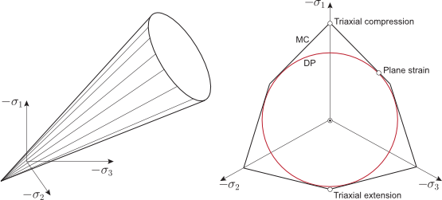
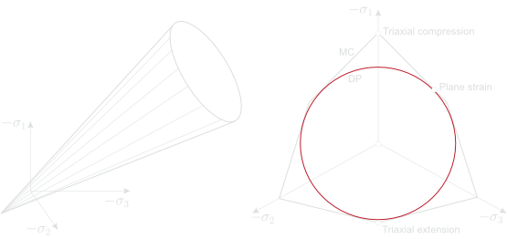

# 7 Drucker Prager

The Drucker-Prager material is very similar to the Mohr-Coulomb material but uses slightly different expressions for the yield and plastic potential function.

## 7.1 Summary of material parameters

The key material parameters are summarized below. More specialized parameters are elaborated on in later sections.

### Stiffness

-   $E$: Young's modulus

-   $\nu$: Poisson's ratio

### Strength

-   $k$: cohesion

-   $M$: friction coefficient

## 7.2 Governing equations

### 7.2.1 Elasticity

Isotropic elasticity defined by $E$ and $\nu$ is used (see [Elasticity](/optum-gx/materials/2-elasticity)).

### 7.2.2 Failure surface

The Drucker-Prager failure surface is given by 

$$
F = q-Mp'-k \tag{7.1}
$$ 

where $k$ and $M$ are the cohesion and friction coefficient respectively.

The Drucker-Prager failure surface depicts a regular cone in three-dimensional stress space as shown in Figure 7.1.

### 7.2.3 Flow rule

The flow potential is given by 

$$
G = q-Np' \tag{7.2}
$$ 

where $M$ is the dilation coefficient.

{#relight}
{#redark}
:::custom-caption
Figure 7.1: Drucker-Prager failure surface (left) and inner Drucker-Prager approximation to Mohr-Coulomb (right).
:::

For Flow Rule = Nonassociated, the same choices regarding dilation cap as for the Mohr-Coulomb model are available.

### 7.2.4 Drucker-Prager versus Mohr-Coulomb

An inner Drucker-Prager approximation of the Mohr-Coulomb failure surface (see Figure 7.1) is achieved by setting: 

$$
M= \frac{3 \sin\phi'}{\sqrt{3+\sin^2\phi'}},~~~
k = \frac{3 c'\cos\phi'}{\sqrt{3+\sin^2\phi'}} \tag{7.3}
$$

This approximation matches the Mohr-Coulomb criterion exactly for the special case of plane strain with $\psi=\phi$.
