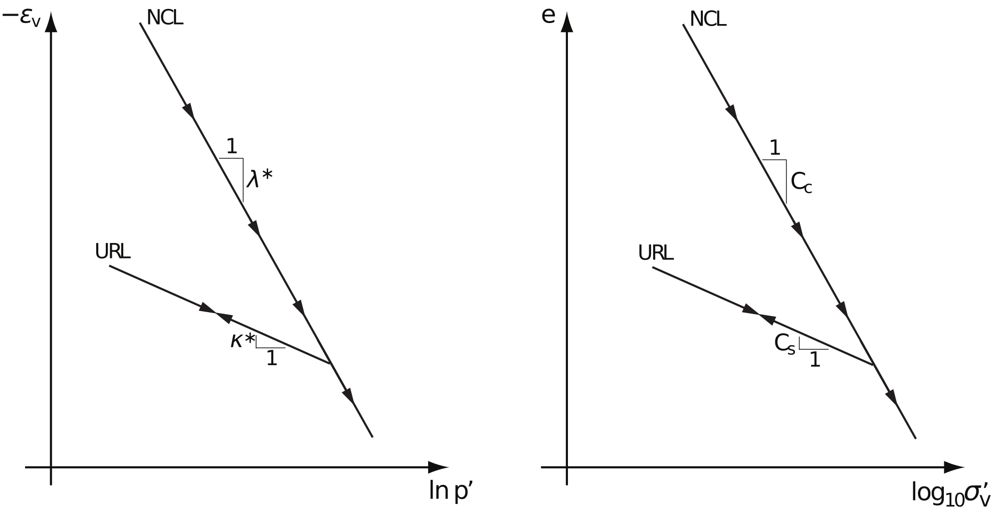

# 8 Modified Cam Clay

The critical state models developed by Roscoe and his co-workers (Roscoe and Burland 1968; Schofield and Wroth 1968) in the 1960s have been widely applied in geomechanics and form the basis of many subsequent models. The Modified Cam Clay (MCC) model of Roscoe and Burland (1968) has been particularly popular. A slightly modified and extended version of this model (including creep and a finite cohesion, while prohibiting crossing of the critical state line) is implemented in GX.

***

## 8.1 Summary of material parameters

### Stiffness

* **Parameter Set A**
  * $\kappa^*$: modified swelling index
  * $\lambda^*$: modified compression index
* **Parameter Set B**
  * $C_s$: conventional swelling index (approximate, see [Section 8.5](#85-oedometric-compression))
  * $C_c$: conventional compression index (approximate, see [Section 8.5](#85-oedometric-compression))
* $\nu$: Poisson’s ratio

### Strength

* $c'$: cohesion
* $\phi'$: friction angle

### Initial Conditions

* **OCR**: overconsolidation ratio (see [Section 8.3](#initial-stresses-and-overconsolidation-ratio))
* $K_0$: earth pressure at rest coefficient
* $e_0$: initial void ratio (only used for Stiffness Parameter Set B)

### Creep

* Creep = Yes: 
  * $\mu^*/\lambda^*$ — relative creep index

---

## 8.2 Governing equations

### 8.2.1 Elasticity

The volumetric and deviatoric stress strain relations are given by

$$
\dot{\varepsilon}_v^e = \frac{1}{K}\dot p', \quad \varepsilon_q = \frac{1}{3G}\dot q \tag{8.1}
$$

{#relight} 
{#redark}
:::custom-caption
Figure 8.1: Modified Cam Clay yield surfaces cut off by failure (critical state) line $q = Mp'$.
:::

where

$$
K = \frac{p'}{\kappa^*}, \quad G = \frac{3(1-2\nu)}{2(1+\nu)}K \tag{8.2}
$$

with $\kappa^*$ being a material parameter (the modified swelling modulus). The general 3D elastic stress–strain relation is:

$$
\dot{\boldsymbol{\varepsilon}} = \mathbb{C}^e \dot{\boldsymbol{\sigma}} \tag{8.3}
$$

where $\mathbb{C}^e$ is given in the [Elasticity](/optum-gx/materials/2-elasticity) section.

---

### 8.2.2 Yield and failure surfaces

The yield function is given by

$$
F = q^2 - M^2 p'(p_c - p') \tag{8.5}
$$

where $p_c$ the preconsolidation pressures, functions as a hardening variable and

$$
M = \frac{3\sin\phi'}{\sqrt{3}\cos\theta + \sin\theta\sin\phi'} \tag{8.5}
$$

where $\phi'$ is the friction angle and $\theta$ is the Lode angle.

The yield surface (8.5) depicts an ellipse in $p'$-$q$ whose size is governed by $p_c$ (see Figure 8.1). The ellipse is such that the line $q=Mp'$ passes through its apex. This line is traditionally referred to as the critical state line. The conventional MCC model allows for stress paths that cross the critical state line. However, in the current implementation this is prohibited. That is, the critical state line is a conventional Mohr-Coulomb failure line given by

$$
F_f = |\sigma_1 - \sigma_3| + (\sigma_1 + \sigma_3)\sin\phi \tag{8.6}
$$

---

### 8.2.3 Flow rules

The flow rule of the yield is the associated flow rule:

$$
\dot{\boldsymbol{\varepsilon}}^p = \dot{\lambda}\frac{\partial F}{\partial \boldsymbol{\sigma}} \tag{8.7}
$$

It is noted that this flow rule implies compaction for all stress states on the yield surface, except at the very top of the ellipse wher $\dot{\varepsilon}_v^p = 0$.

For the failure surface, a nonassociated flow rule is used:

$$
\dot{\boldsymbol{\varepsilon}}^p_f = \dot{\lambda}_f\frac{\partial G_f}{\partial \boldsymbol{\sigma}} \tag{8.8}
$$

where

$$
G_f = |\sigma_1 - \sigma_3| \tag{8.9}
$$

implying zero dilation.

---

### 8.2.4 Hardening law

The hardening law is such that the change in $p_c$ is proportional to the change in $\varepsilon_v^p$:

$$
\dot p_c = \frac{p_c}{\lambda^* - \kappa^*}\dot{\varepsilon}_v^p \tag{8.10}
$$

where $\lambda^*$ is a material parameter, in the following referred to as the modified compression index. This hardening law implies that the yield surface expands $\dot p_c>0$ up to the critical state line where $\dot p_c=0$ and the ultimate limit state is reached. 

---

### 8.2.5 Cohesion

Cohesion is accommodated by replacing the mean effective stress by the following modified mean effective stress throughout:

$$
\tilde{p}' = -\tfrac{1}{3}(\sigma_x' + \sigma_y' + \sigma_z') + \frac{c'}{\tan\phi'} \tag{8.11}
$$

---

### 8.2.6 Creep

For certain clays, creep (or secondary compression) accounts for a significant part of the total deformation. An often used empirical law states that the volumetric creep strain following full primary consolidation is given by

$$
\varepsilon_v^c = \frac{C_\alpha}{1+e}\log_{10}\left(\frac{t}{t_{90}}\right) \tag{8.12}
$$

and more generally between times $t_n$ and $t_{n+1}$:

$$
\Delta\varepsilon_v^c = \frac{C_\alpha}{1+e}\log_{10}\left(\frac{t_{n+1}}{t_n}\right) \tag{8.13}
$$

For a layer of depth $H$, the vertical settlement due to creep is:

$$
\Delta u^c = H\frac{C_\alpha}{1+e}\log_{10}\left(\frac{t_{n+1}}{t_n}\right) \tag{8.14}
$$

In OPTUM GX, creep follows Borja (1985):

$$
\boldsymbol{\varepsilon} = \boldsymbol{\varepsilon}^e + \boldsymbol{\varepsilon}^p + \boldsymbol{\varepsilon}^c \tag{8.15}
$$

with creep potential

$$
\frac{d\Phi^c}{dt} = \frac{\mu^*}{\tau_0}\exp\left(-\frac{1}{\mu^*}\Phi^e\right), \quad \Phi(0)=0 \tag{8.16}
$$

and creep strain evolution

$$
\frac{d\boldsymbol{\varepsilon}^c}{dt} = \boldsymbol{a}\frac{d\Phi^c}{dt} \tag{8.17}
$$

where 

$$
\boldsymbol{a} = \frac{\partial F^c}{\partial \boldsymbol{\sigma}'} \tag{8.18}
$$

$$
F^c = \tilde{p}' + \frac{q^2}{M^2\tilde{p}'} \tag{8.19}
$$

Typically $\mu^*/\lambda^*$ ranges from 0.02–0.1 for natural materials prone to creep.

For 1D conditions:

$$
\varepsilon_v^c = \mu^*\ln\left(\frac{t + \tau_0}{\tau_0}\right) \tag{8.20}
$$ 

and

$$
\Delta\varepsilon_v^c = \mu^*\ln\left(\frac{t + \tau_0}{t_{90} + \tau_0}\right) \tag{8.21}
$$

which approaches the empirical form for $t \gg \tau_0 = 1$ day.

***

## 8.3 Initial stresses and overconsolidation ratio

The overconsolidation ratio is:

$$
\text{OCR} = \frac{\sigma_{v,0}'}{\sigma_{c,0}} \tag{8.22}
$$

In the oedometer test (1D), the stresses at yield are:

$$
\begin{aligned}
\sigma_x'{}^* &= \sigma_{x,0}' + (\text{OCR} - 1)\frac{\nu}{1 - \nu}\sigma_{z,0}' \\
\sigma_y'{}^* &= \sigma_{y,0}' + (\text{OCR} - 1)\frac{\nu}{1 - \nu}\sigma_{z,0}' \\
\sigma_z'{}^* &= \text{OCR}\,\sigma_{z,0}' \\
\tau_{xy}^* &= \tau_{xy,0}, \quad
\tau_{yz}^* = \tau_{yz,0}, \quad
\tau_{zx}^* = \tau_{zx,0}
\end{aligned} \tag{8.23}
$$

The corresponding preconsolidation pressure:

$$
p_{c,0} = \tilde{p}'{}^* + \frac{q^{*2}}{M^2 \tilde{p}'{}^*} \tag{8.24}
$$

***

## 8.4 Isotropic compression

For isotropic compression ($\sigma_1' = \sigma_2' = \sigma_3' = p'$), before yield:

$$
\dot{\varepsilon}_v = \frac{\kappa^*}{p'}\dot{p}' \tag{8.25}
$$

At yield ($p' = p_c$):

$$
\dot{\varepsilon}_v = \frac{\lambda^*}{p'}\dot{p}' \tag{8.26}
$$

Thus:

$$
\frac{d\varepsilon_v}{dp'} =
\begin{cases}
\frac{\kappa^*}{p'}, & p' < p_c \\
\frac{\lambda^*}{p'}, & p' = p_c
\end{cases} \tag{8.27}
$$

{#relight} 
{#redark}

***

## 8.5 Oedometric compression

In the oedometer test, all strains except the vertical are zero. The result is a bilinear relation:

$$
\frac{de}{d\log_{10}\sigma_v'} =
\begin{cases}
C_s, & \sigma_v' < \sigma_c \\
C_c, & \sigma_v' = \sigma_c
\end{cases} \tag{8.28}
$$

where

$$
e = (1 + e_0)(1 - \varepsilon_v) - 1 \tag{8.29}
$$

and approximate conversions are:

$$
\begin{aligned}
\kappa^* &\approx \frac{C_s}{2.3(1 + e_0)} \\
\lambda^* &\approx \frac{C_c}{2.3(1 + e_0)}
\end{aligned} \tag{8.30}
$$

In OPTUM GX, the user has a choice between two parameter sets: A ($\kappa^*, \lambda^*$) or B ($C_s, C_c$); In the case of Set B, the above relations are used to calculate equivalent $\kappa^*$ and $\lambda^*$.
